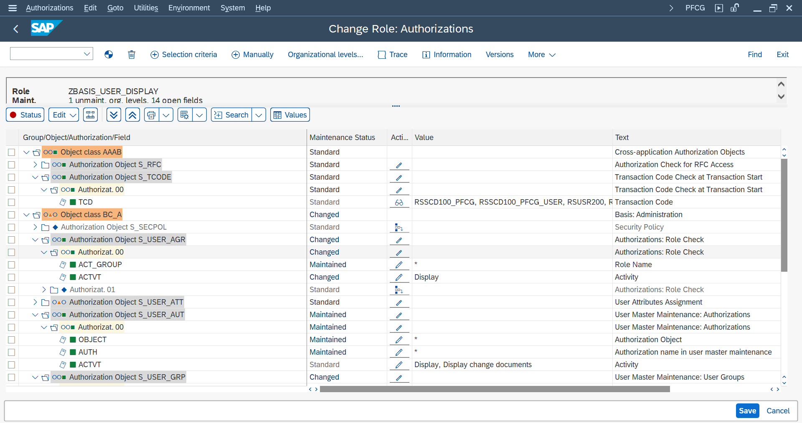
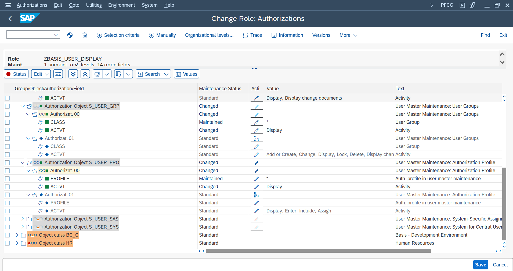

# 🛠️ SAP Authorization — Hands-On Practice
> **Exercise:** Real World Role Building & User Assignment  
> **Date:** March 2026  
> **System:** S1A  

---

## 👤 User to Create

| User ID | Full Name | User Type | Purpose |
|---|---|---|---|
| **BASISADMIN1** | <!-- Add name --> | Dialog | Read-only BASIS admin |

---

## 🎭 Roles to Create

### Role 1 — User & Role Viewer

| Field | Value |
|---|---|
| **Role Name** | `ZBASIS_USER_DISPLAY` |
| **Description** | Display only access for user and role viewing |
| **Type** | Single Role |
| **Status** | ⬜ To Create |

#### T-codes to add to Menu:

| T-Code | Description | Status |
|---|---|---|
| `SU01` | User Maintenance — Display only | ⬜ |
| `SUIM` | User Information System | ⬜ |
| `SU56` | Display User Auth Buffer | ⬜ |

#### Auth Objects & Field Values:

| Auth Object | Field | Value | Purpose | Verified in SU24? |
|---|---|---|---|---|
| S_TCODE | TCD | SU01, SUIM, SU56 | T-code access | ⬜ |
| S_USER_GRP | ACTVT | **03** only | Display users — no edit/create/delete! | ⬜ |
| S_USER_GRP | CLASS | * | All user groups | ⬜ |
| S_USER_AGR | ACTVT | **03** only | Display role assignments only | ⬜ |
| S_USER_AGR | AGR_NAME | * | All roles | ⬜ |
| S_USER_AUT | ACTVT | **03** only | Display authorizations only | ⬜ |
| S_USER_AUT | OBJCT | * | All auth objects | ⬜ |
| S_USER_PRO | ACTVT | **03** only | Display profiles only | ⬜ |
| S_USER_PRO | PROF | * | All profiles | ⬜ |





#### ⚠️ Key Restriction:
```
BASISADMIN1 can DISPLAY users and roles
but CANNOT edit, create or delete!
        │
        ▼
ACTVT = 03 (Display only!)
ACTVT = 01 (Create)  ❌ DO NOT give!
ACTVT = 02 (Change)  ❌ DO NOT give!
ACTVT = 06 (Delete)  ❌ DO NOT give!
```

---

### Role 2 — Transport Viewer

| Field | Value |
|---|---|
| **Role Name** | `ZBASIS_TRANSPORT_DISPLAY` |
| **Description** | Display only access for transport viewing in STMS |
| **Type** | Single Role |
| **Status** | ⬜ To Create |

#### T-codes to add to Menu:

| T-Code | Description | Status |
|---|---|---|
| `STMS` | Transport Management System — Display only | ⬜ |

#### Auth Objects & Field Values:

| Auth Object | Field | Value | Purpose | Verified in SU24? |
|---|---|---|---|---|
| S_TCODE | TCD | STMS | T-code access | ⬜ |
| S_CTS_ADMI | CTS_ADMFCT | **DISP** | Display transports — no import! | ⬜ |
| S_TRANSPRT | ACTVT | **03** only | Display transport requests only | ⬜ |
| S_TRANSPRT | TTYPE | * | All transport types | ⬜ |

#### ⚠️ Key Restriction:
```
BASISADMIN1 can VIEW transports in STMS
but CANNOT import transports!
        │
        ▼
S_CTS_ADMI → CTS_ADMFCT:
DISP = Display only ✅ GIVE THIS
IMPO = Import       ❌ DO NOT give!
ALL  = All actions  ❌ DO NOT give!
```

---

## 📋 Step by Step Checklist

### Phase 1 — Create User
- [ ] Open SU01
- [ ] Create user BASISADMIN1
- [ ] Set user type = Dialog
- [ ] Set initial password
- [ ] Save ✅

### Phase 2 — Create Role 1 (ZBASIS_USER_DISPLAY)
- [ ] Open PFCG
- [ ] Create role ZBASIS_USER_DISPLAY
- [ ] Add description
- [ ] Go to Menu tab → add T-codes (SU01, SUIM, SU56)
- [ ] Go to Authorizations tab
- [ ] Research auth objects in SU24 for each T-code
- [ ] Fill auth object field values
- [ ] Generate profile ✅
- [ ] Save ✅

### Phase 3 — Create Role 2 (ZBASIS_TRANSPORT_DISPLAY)
- [ ] Open PFCG
- [ ] Create role ZBASIS_TRANSPORT_DISPLAY
- [ ] Add description
- [ ] Go to Menu tab → add T-code (STMS)
- [ ] Go to Authorizations tab
- [ ] Research auth objects in SU24 for STMS
- [ ] Fill auth object field values (display only!)
- [ ] Generate profile ✅
- [ ] Save ✅

### Phase 4 — Assign Roles to User
- [ ] Open SU01 → BASISADMIN1
- [ ] Go to Roles tab
- [ ] Assign ZBASIS_USER_DISPLAY
- [ ] Assign ZBASIS_TRANSPORT_DISPLAY
- [ ] Set valid from/to dates
- [ ] Save ✅
- [ ] Run User Comparison

### Phase 5 — Test Access
- [ ] Login as BASISADMIN1
- [ ] Test SU01 → can display users? ✅
- [ ] Test SU01 → try to edit → should FAIL ❌
- [ ] Test SUIM → can run reports? ✅
- [ ] Test SU56 → can view buffer? ✅
- [ ] Test STMS → can view transports? ✅
- [ ] Test STMS → try to import → should FAIL ❌

### Phase 6 — Troubleshoot (if needed)
- [ ] Run SU53 for any failures
- [ ] Note down missing objects
- [ ] Fix in PFCG
- [ ] Regenerate profile
- [ ] Re-login and retest ✅

---

## 🔍 SU24 Research Notes
> ✏️ *Fill this in as you go through SU24 for each T-code*

### SU01 — Auth Objects found in SU24:

| Object | Fields | Default? | Notes |
|---|---|---|---|
| <!-- --> | <!-- --> | <!-- --> | <!-- --> |
| | | | |

### SUIM — Auth Objects found in SU24:

| Object | Fields | Default? | Notes |
|---|---|---|---|
| <!-- --> | <!-- --> | <!-- --> | <!-- --> |
| | | | |

### SU56 — Auth Objects found in SU24:

| Object | Fields | Default? | Notes |
|---|---|---|---|
| <!-- --> | <!-- --> | <!-- --> | <!-- --> |
| | | | |

### STMS — Auth Objects found in SU24:

| Object | Fields | Default? | Notes |
|---|---|---|---|
| <!-- --> | <!-- --> | <!-- --> | <!-- --> |
| | | | |

---

## 🐛 Issues & Fixes Log
> ✏️ *Track any issues you hit during testing*

| # | Issue | SU53 Showed | Fix Applied | Status |
|---|---|---|---|---|
| 1 | <!-- describe --> | <!-- object --> | <!-- what you did --> | ⬜ |
| 2 | | | | |
| 3 | | | | |

---

## 💡 Key Learnings from this Exercise

> ✏️ *Fill this in after you complete the exercise*

| # | Learning |
|---|---|
| 1 | <!-- what you learned --> |
| 2 | |
| 3 | |

---

## 📊 Progress Summary

```
Create User          ░░░░░░░░░░  0%
Role 1 — User View   ░░░░░░░░░░  0%
Role 2 — TMS View    ░░░░░░░░░░  0%
Assign Roles         ░░░░░░░░░░  0%
Testing              ░░░░░░░░░░  0%
```

> ✏️ *Update as you complete each phase!*
> Each `█` = 10%

---

## 🏆 Success Criteria

| Test | Expected Result | Actual Result |
|---|---|---|
| BASISADMIN1 opens SU01 | ✅ Can open | <!-- --> |
| BASISADMIN1 tries to create user | ❌ Should fail | <!-- --> |
| BASISADMIN1 tries to edit user | ❌ Should fail | <!-- --> |
| BASISADMIN1 opens SUIM | ✅ Can open | <!-- --> |
| BASISADMIN1 opens SU56 | ✅ Can open | <!-- --> |
| BASISADMIN1 opens STMS | ✅ Can open | <!-- --> |
| BASISADMIN1 tries to import transport | ❌ Should fail | <!-- --> |

---

*📝 Part of SAP BASIS Admin Hands-On Practice Series*  
*Date: March 2026*

---

## 📖 Quick Reference — ACTVT Values

| Value | Meaning | Give to BASISADMIN1? |
|---|---|---|
| 01 | Create | ❌ No |
| 02 | Change | ❌ No |
| 03 | Display | ✅ Yes |
| 05 | Lock/Unlock | ❌ No |
| 06 | Delete | ❌ No |
| 78 | Assign Roles | ❌ No |

## 📖 Quick Reference — CTS_ADMFCT Values

| Value | Meaning | Give to BASISADMIN1? |
|---|---|---|
| DISP | Display transports | ✅ Yes |
| IMPO | Import transports | ❌ No |
| TABL | Table comparisons | ❌ No |
| ALL | All actions | ❌ No |
